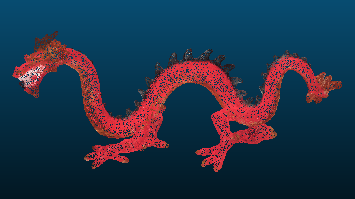
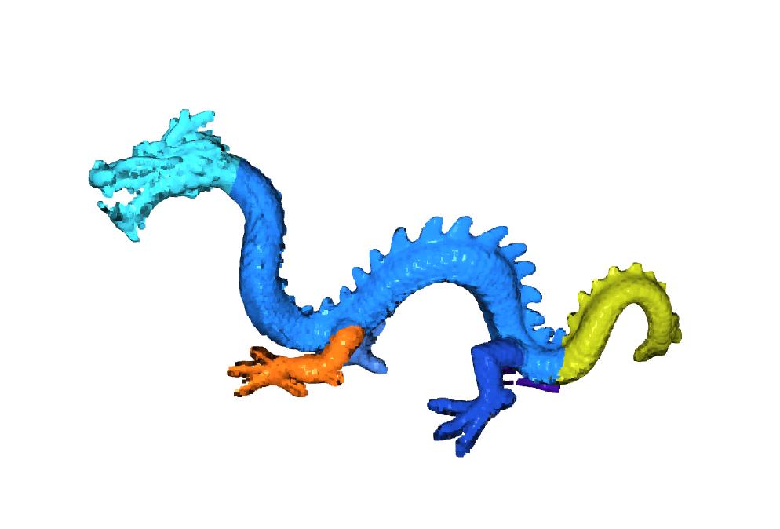

## Quick Start
### Put your raw data in right place
Put your raw point cloud data in ```./data```

File structure should be like this
```bash
.
└── 2-l
    ├── 2-l - Cloud-body.txt
    ├── 2-l - Cloud-foot1.txt
    ├── 2-l - Cloud-foot2.txt
    ├── 2-l - Cloud-foot3.txt
    ├── 2-l - Cloud-foot4.txt
    ├── 2-l - Cloud-head.txt
    ├── 2-l - Cloud-tail.txt
    ├── 2-l-1.JPG
    ├── 2-l-2.JPG
    ├── 2-l-3.JPG
    ├── 2-l-4.JPG
    ├── 2-l-5.JPG
    ├── 2-l-6.JPG
    └── 2-l.ply
```

```2-l.ply``` is the raw point clouds

```*.txt``` is the parts' segmentation for annotations

```*.jpg``` is the different view of 3D object

**Please make sure the file extension is .ply->raw point clouds, .txt->segmentated point cloud**

### Preprocess the dataset
```python
python main.py -s ./data -d ./res
```
The result will be stored in ```./res```

File structure of ```./res```
```
.
└── 2-l
    ├── annotation.txt
    ├── clean_100k.ply
    ├── clean_10k.ply
    ├── clean_1k.ply
    ├── info.txt
    ├── mesh.ply
    ├── noiseless.ply
    ├── real_100k.ply
    ├── real_10k.ply
    └── real_1k.ply
```
```info.txt``` is basic info for this 3D shape

```annotation.txt``` is info for anootations

```clean_*k.ply``` is point cloud sampled from reconstructed mesh

```real_*k.ply``` is point cloud sampled from noiseless point cloud

```noiseless.ply``` is noiseless point cloud sampled from raw point cloud

#### Example for clean_100k



### Show annotation
```python
python show_annotation.py -i ./res/2-l
```

#### Example for annotation


